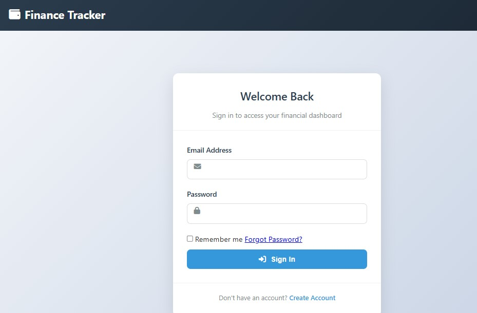
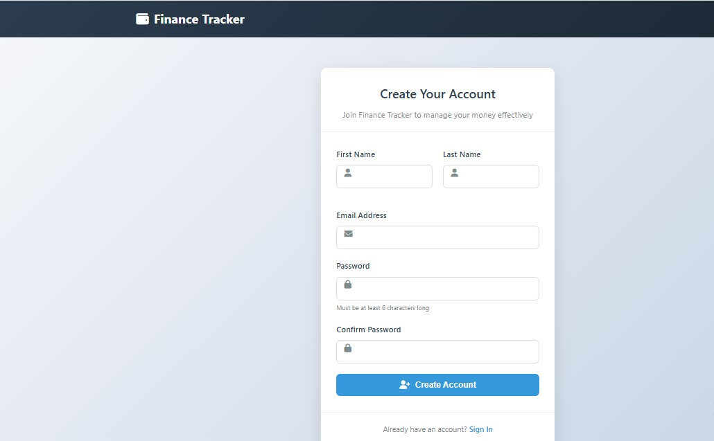

# Finance-Tracker

A web application for tracking income, expenses, and generating financial reports. It aims to help users monitor and manage their personal finances through an intuitive interface.

---

## Table of Contents

1. [Features](#features)  
2. [Tech Stack](#tech-stack)  
3. [Project Structure](#project-structure)  
4. [Getting Started](#getting-started)  
   - [Prerequisites](#prerequisites)  
   - [Installation](#installation)  
   - [Running the Application](#running-the-application)  
5. [Usage](#usage)  
6. [Configuration](#configuration)  
7. [Contributing](#contributing)  
8. [License](#license)  
9. [Contact](#contact)

---

## Features

- Record and categorise income and expenses.  
- View financial summaries and reports over time.  
- User-friendly dashboard.  
- Secure routing and middleware to protect routes.  

---

## Tech Stack

| Component     | Technology         |
|----------------|----------------------|
| Backend        | Node.js, Express     |
| Templating     | EJS                 |
| Routing        | Express Router       |
| Styling / UI   | CSS, HTML           |
| Middleware     | Custom middleware for route protection, etc. |
| Views / Frontend | EJS views, public assets (JS/CSS) |

---

## Project Structure

Finance-Tracker/
├── config/ # Configuration files (e.g., database, environment variables)
├── controllers/ # Logic for handling requests
├── middleware/ # Route guards, authentication, etc.
├── public/ # Static files (CSS, client JS, images)
├── routes/ # Route definitions
├── views/ # EJS templates
├── index.js # Entrypoint for setting up Express app
├── server.js # Server start logic
└── package.json # Project metadata and dependencies

---

## Getting Started

### Prerequisites

Ensure you have the following installed on your system:

- Node.js (version 14.x or newer)  
- NPM or Yarn  
- (Optional) A database, if your setup requires persistence beyond in-memory or files  

### Installation

1. Clone the repository:
   git clone https://github.com/aristobells/Finance-Tracker.git

2. Navigate into the project directory:

  cd Finance-Tracker

3. Install dependencies:

  npm install

  or, if using yarn:
  yarn install

4. Set up configuration (environment variables):

Create a .env file if not present.

Define any necessary variables (e.g. PORT, DB_CONNECTION, etc.).

Running the Application

To start the development server:
npm start

or, if using nodemon:
npm run dev
By default, the server will run on http://localhost:3000 (unless another port is specified via configuration).

Usage

Once running:

- Navigate to the home page to view the dashboard.

- Use designated routes to add, edit, or delete income/expense records.

- Access the reporting page or summary view to monitor your financial trends over time.

- Static assets (stylesheets, client-side scripts) are served from the public/ directory.

Configuration

You may need to configure:

- Port — default vs custom

- Database or data storage — whether you’re using a local file, in-memory store, or an external database

- Authentication / user settings (if applicable)
- 
- Middleware settings, such as logging, error handling, etc.

Contributing

Contributions are welcome. To contribute:

- Fork the repository.

- Create a feature branch: git checkout -b feature/YourFeatureName

- Make your changes and test them.

- Commit your changes with clear, descriptive messages.

- Push to your branch: git push origin feature/YourFeatureName

- Open a Pull Request, describing what you have changed and why.

Contact

Project maintained by aristobells.

For questions or feedback, reach out via:

GitHub: aristobells

Email: adelajatobiemmanuel@gmail.com

## Preview

Below are some screenshots of the Finance-Tracker application in action:

### Dashboard  
Provides an overview of income, expenses, and balance trends.  

---

### Add Transaction Form  
Form for adding income or expense records.  

---

###  Transaction page  
Form for viewing income or expense records with advance filter and sorting features.  

---
### Add Budget Form  
Form for adding buget records.  

---

### Budget page 
Form for viewing all buget records and tracking the progress.  

---

### Login and Log out 
 
 

